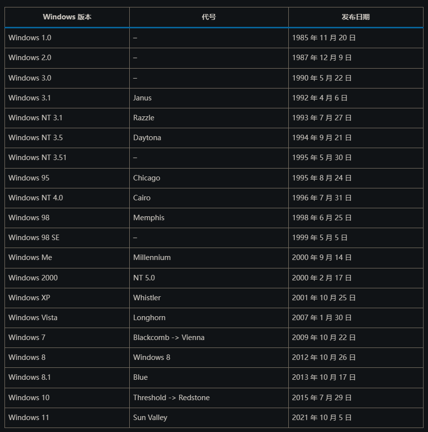

说到这个，坑可不少，不只是win10，在更早的windows版本中都出现类似的问题。
Python模块内部多是老代码，从而造成各种直觉上的问题，例如使用``PyMouse``进行鼠标移动，或是使用``PIL``等模块进行截屏，都容易出现预期之外的结果，而且还是那种 **“我电脑上跑得好好的到你这怎么就出问题”** 的恶劣情况，~~搞兼容的孩子有福了(坐牢坐到饱~~

实际上不只是Python模块，win自己的API也是有不少问题，或者说正是因为winAPI有问题才导致了部分Python模块在获取屏幕相关信息时也出现了错误。

由于问题非常的多，三言两语说不清(v软常有的shi山问题)，这里将进行几份内容进行说明。

 

顺便附上windos各版本的发行时间：

# 题外话：
- 屏幕投影的“复制”，不太确定它到底是以什么方式实现(因为手上没有分辨率不一致的屏幕)，个人猜测是比例调整，也就是常说的拉伸操作，纵横比例是不一致的，并不是单纯的缩放。
- 课堂教学时使用到的投影仪实际上也是屏幕的一种，而这恰好对应“屏幕投影”的原本含义。

# 吐槽
与DPI相关的问题越是深入越感觉这的水是深不见底(其实是shi山的交错堆积，但为了兼容不能直接铲掉)。

顺带叠层甲，这篇分析DPI的内容大致是没错的，在细节方面不能保证正确，因为坑一大堆，而且牵扯的东西乱七八糟的，没本事一个一个核对。

# 参考：
- Windows 版本历史回顾：[https://www.sysgeek.cn/windows-version-history/](https://www.sysgeek.cn/windows-version-history/)
- WIN8如何以"扩展"方式投影到第二屏幕(或投影仪)：[https://jingyan.baidu.com/article/c275f6bacf3121e33c756741.html](https://jingyan.baidu.com/article/c275f6bacf3121e33c756741.html)

