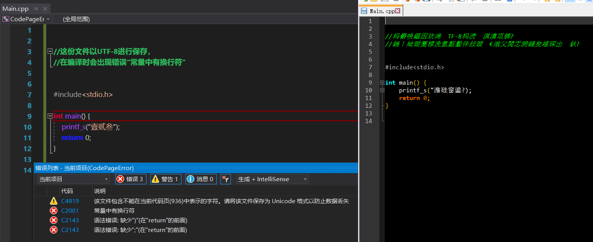
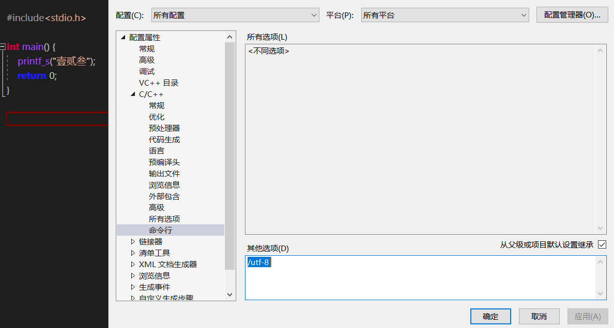
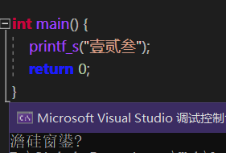
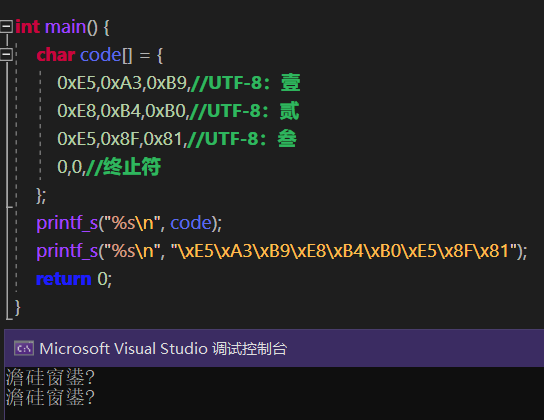
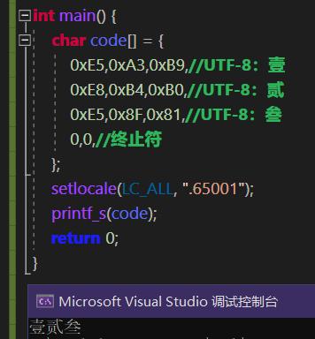
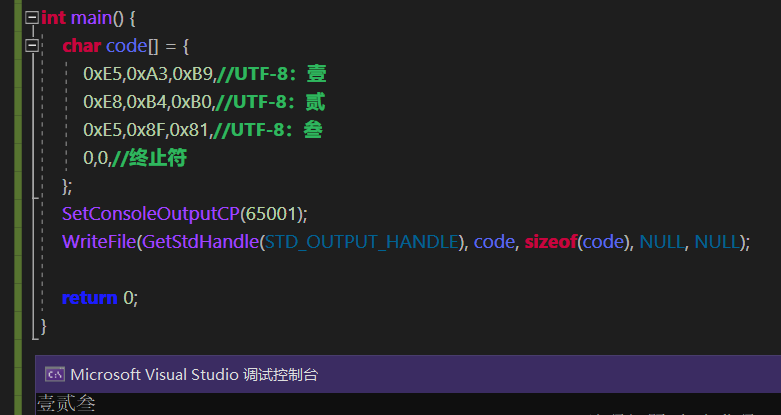
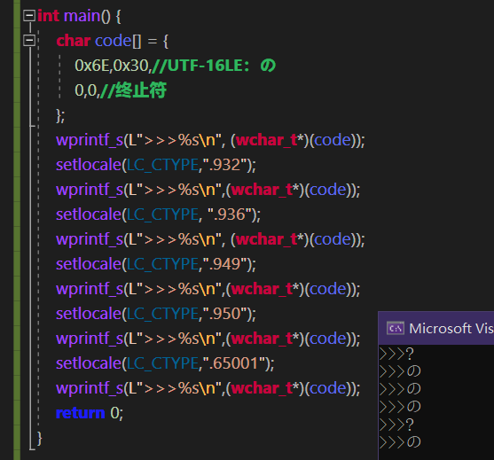
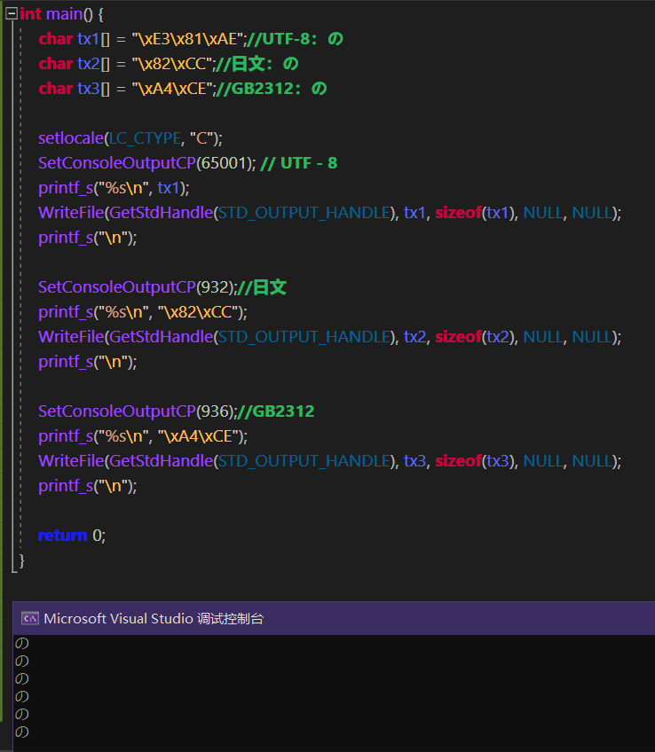
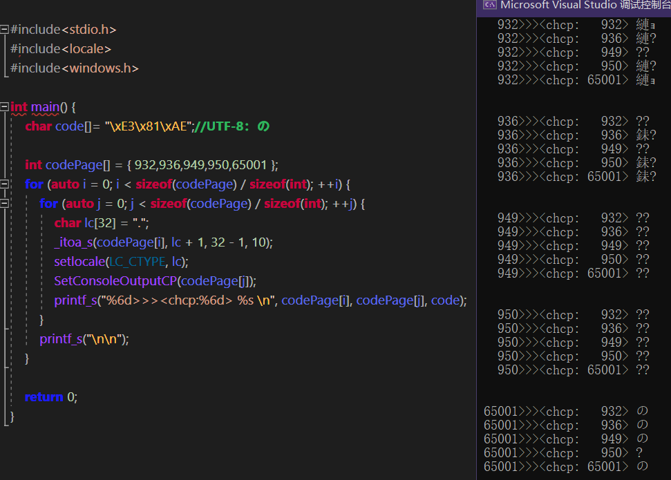

这里将探究一段字符串从源码到控制台窗口(命令行界面CUI)的变化过程，从底层说明乱码的产生。

 
 

## 1、编译错误：

这个源文件中有一段中文字符串``"壹贰叁"``，文件使用UTF-8编码，在VS2019中以“文件→高级文件保存”的方式选择文件编码。

编译器默认使用ANSI编码，或者说使用的是GBK编码，对这个文件进行编译时会出现编译错误，而那怪异的报错在IDE中是无法检查出问题根源的。
但若是将这份源文件以GBK进行打开，则会发现原本的中文字串竟然变成了一段乱码，而这才是编译器真正看到的源码内容，并且不仅出现了乱码，字串的引号也被吞掉，这也不难理解为何编译无法通过。

其中，提示的那段警告``“该文件包含不能在当前代码页(936)中表示的字符”``正说明编译器使用的是936代码页。

#### 1.1、项目配置解决编译器代码页问题：
既然编译器使用的是ANSI编码(936代码页)，那想办法让它使用UTF-8进行编译不就可以了？
实际上在项目配置中是有个地方能够设置编译器的参数。

再进行编译，程序能够成功生成。

## 2、输出乱码：
对上面的生成好的程序进行运行，会发现它输出了一段乱码，
后面(第3点)会说明这段乱码到底是什么原因导致的。

#### 2.1、编译器处理字符：
编译器采用指定的编码加载源文件并进行分析，其中的字符常量终将会被转化为一个个的字节流存储到程序文件中，一般将这种写进程序的称为硬数据/硬编码。

实际上将``"壹贰叁"``的UTF-8编码直接写进一个数组中，或者使用``"\xXX"``转义字符，哪怕不对编译器配置``/utf-8``参数，生成的程序在运行后一样会得到同样的乱码结果：

### 2.2、L字符串：
编译器会对L字符串额外地进行一次编码转换，将A字串转为W字串，如果这个过程中使用了错误的字符集的话，转换后的W字串(UTF-16编码)只会变得更加的混乱。

为了避免编译器对字串造成的影响，我后面使用的代码示例都尽可能的以字符数组(准确的说是字节流)或是``"\xXX"``转义字符的形式来进行演示。

## 3、设置CTR函数字符集：
调用``printf_s``输出时出现了乱码，正说明``printf_s``里头出现了编码转换行为，它将UTF-8的编码转换为了其他的东西，因此就需要调用特别的函数进行字符集设置。
这里的特别函数就是``setlocale/_wsetlocale``，它用于设置程序字符集，准确的说是设置CTR(C-RunTime)函数的字符集。

设置了字符集65001后，会发现输出结果正常了，可喜可贺可喜可贺。

 

## 4、探究printf_s/wprintf_s的行为：
从这开始，就是一片雷池，
决心踏入的都是勇士，普通人则建议直接跳过本点内容。
以下内容都是基于Windows平台，不同操作系统各有差异。

#### 4.1、使用WriteFile+SetConsoleOutputCP进行输出：
事实上完全有能力用其他方式进行输出，倒不如说``printf_s``的底层就是依据这个方式进行输出的。
这个方式到底指的是什么呢，实际上就是``WriteFile``。你所能见到的字串输出函数，本质上就是调用``WriteFile``这个winAPI的。

这里可以看到，这还调用了一个函数``SetConsoleOutputCP``。
从这可以看到，进程中的字节流数据要想顺利打印出来，就得进行两步操作：

- 字节流写入缓冲区；
- 缓冲区内容输出至窗口；

而后者需要调用``SetConsoleOutputCP``使用指定的字符集来将缓冲区中的字节流顺利地表示为一个个的字符。
``SetConsoleOutputCP``用于设置控制台代码页，它的效果等同于执行``system("chcp XXX")``，只不过通过后者通常还自带清屏效果。

#### 4.2、探究wprintf_s：
既然已经知道了最终是使用``WriteFile``写入**字节流**，那么``wprintf_s``这个以宽字符(2字节)为单位的又该如何进行输出呢？
实际上调用``wprintf_s``输出的UTF-16字符串并不会直接写入缓冲区，而是先经过一次编码转换，至于这个编码所使用的字符集，则是由``setlocale``这个函数决定的。如果出现了字符集无法表达的字符时，会将这个字符转化为一个问号(或是其他奇怪的东西)。

有人就问了，为什么这里用的是``setlocale``，没有对应的winAPI吗？这问题问得好，我也曾尝试去寻找是否有对应的winAPI进行设置，答案是没有，
但仔细一想又会发现，``wprintf_s``是个CRT函数，所有CRT字串相关函数所使用的字符集都应该(或者说是只能)由``setlocale``来决定，这自然也包括了``printf_s``，没错，哪怕是``printf_s``这看上去应该直接将字符串直接灌进缓冲区的，实际上它还是经过了一层多余的编码转换，后面再提。

同时再补充一点，``setlocale``默认使用“C”这个玩意儿，你也可以理解为这玩意儿用的是ASCII字符集，
于是就会出现“如果我不调用``setlocale``那么``wprintf_s``几乎没有输出”的窘境，因为全特么转化为空字符或者问号字符了，看不到输出很正常。

#### 4.3、探究printf_s：
如果用默认的“C”区域设置，也就是``setlocale("C")``，那``printf_s``不会对原字节流进行任何改动就直接输出的，就，很美妙，可以看到它并不吃``SetConsoleOutputCP``的影响，效果就和``WriteFile``直接往标准输出灌字节流一样。

而除“C”区域设置外的其他区域语言，在调用``printf_s``时原字节流会被进行两次字节流检查操作，就很让人觉得好笑但又觉得于情于理：
- 首此转码会将指定字节流以CRT字符集进行解析，无意义(或者说在在字符集中无定义)的字节流将会被替换为一个问号；
- 如果控制台字符集与CRT字符集不一致，则会进行额外的一次编码转换，将CRT字符集的字串转化为控制台字符集的字串，同样的，会将不出现在控制台字符集的字节流替换为一个问号；

如果当前的标准输出并不是控制台而是一个管道(使用winAPI``CreateProcess``创建一个标准输入输出重定向的子进程)，那么就如同C区域语言一样不会进行编码转换直接输出，哪怕``setlocale``设置了奇奇怪怪的区域语言也一样不会受干扰，美妙至极，至于调用``freopen``重定向到文件的实际情况就没去测试了，个人猜测一样是不会受到影响。
这里不提供示例代码。

 
 

## 5、总结：

#### 代码页/字符集：
简单总结所有可能出现字符集/代码页的地方，但凡这些字符集有一处是不一致的都可能造成输出乱码。
- 源文件；
- 编译器；
- CRT函数/区域语言；
- 控制台输出；

#### 避免乱码：
- 保证源文件字符集与编译器使用的字符集一致；
- 保证CRT字符集与源文件字符集一致；
- 时刻掌握所有字符串的字符集，最好保证它们都是统一的，如果使用``char``则尽量使用UTF-8，使用``wchar_t``则将项目中所有出现``char``字串的地方全部替换为``wchar_t``，A系函数和W系函数混用并不能带来多少好处(反而到处埋雷)；

 

# 参考：
- printf和wprintf：[https://learn.microsoft.com/zh-cn/cpp/c-runtime-library/format-specification-syntax-printf-and-wprintf-functions](https://learn.microsoft.com/zh-cn/cpp/c-runtime-library/format-specification-syntax-printf-and-wprintf-functions)
- 代码页标识符：[https://learn.microsoft.com/zh-cn/windows/win32/intl/code-page-identifiers](https://learn.microsoft.com/zh-cn/windows/win32/intl/code-page-identifiers)
- 国家语言支持函数：[https://learn.microsoft.com/zh-cn/windows/win32/intl/national-language-support-functions](https://learn.microsoft.com/zh-cn/windows/win32/intl/national-language-support-functions)
- UCRT 区域设置名称、语言和国家/地区字符串：[https://learn.microsoft.com/zh-cn/cpp/c-runtime-library/locale-names-languages-and-country-region-strings](https://learn.microsoft.com/zh-cn/cpp/c-runtime-library/locale-names-languages-and-country-region-strings)
- 语言字符串：[https://learn.microsoft.com/zh-cn/cpp/c-runtime-library/language-strings?view=msvc-170](https://learn.microsoft.com/zh-cn/cpp/c-runtime-library/language-strings?view=msvc-170)
- 国家/地区字符串：[https://learn.microsoft.com/zh-cn/cpp/c-runtime-library/country-region-strings?view=msvc-170&source=recommendations](https://learn.microsoft.com/zh-cn/cpp/c-runtime-library/country-region-strings?view=msvc-170&source=recommendations)
- setlocale，_wsetlocale：[https://learn.microsoft.com/zh-cn/cpp/c-runtime-library/reference/setlocale-wsetlocale?view=msvc-170](https://learn.microsoft.com/zh-cn/cpp/c-runtime-library/reference/setlocale-wsetlocale?view=msvc-170)
- 代码页：[https://learn.microsoft.com/zh-cn/windows/win32/intl/code-pages](https://learn.microsoft.com/zh-cn/windows/win32/intl/code-pages)
- 控制台程序的中文输出乱码问题,printf,wprintf与setlocale：[https://www.cnblogs.com/dejavu/archive/2012/09/16/2687586.html](https://www.cnblogs.com/dejavu/archive/2012/09/16/2687586.html)
- 汉字字符集编码查询：[https://www.qqxiuzi.cn/bianma/zifuji.php](https://www.qqxiuzi.cn/bianma/zifuji.php)
- 日文字符集Shift_JIS：[http://charset.7jp.net/sjis.html](http://charset.7jp.net/sjis.html)
- SetConsoleOutputCP：[https://learn.microsoft.com/zh-cn/windows/console/setconsoleoutputcp](https://learn.microsoft.com/zh-cn/windows/console/setconsoleoutputcp)
- WriteFile：[https://learn.microsoft.com/zh-cn/windows/win32/api/fileapi/nf-fileapi-writefile](https://learn.microsoft.com/zh-cn/windows/win32/api/fileapi/nf-fileapi-writefile)
- 经典控制台 API 与虚拟终端序列：[https://learn.microsoft.com/zh-cn/windows/console/classic-vs-vt?source=recommendations#unicode](https://learn.microsoft.com/zh-cn/windows/console/classic-vs-vt?source=recommendations#unicode)
- Visual Studio C++默认UTF-8编码及*.editorconfig统一代码格式：[https://www.cnblogs.com/mechanicoder/p/16894144.html](https://www.cnblogs.com/mechanicoder/p/16894144.html)
- printf_s：[https://cloud.tencent.com/developer/section/1009160](https://cloud.tencent.com/developer/section/1009160)
- 深入理解Unicode，UTF编码和wchar_t：[https://blog.csdn.net/weixin_42039389/article/details/109549201](https://blog.csdn.net/weixin_42039389/article/details/109549201)
- CRT 中的全局状态：[https://learn.microsoft.com/zh-cn/cpp/c-runtime-library/global-state?view=msvc-170](https://learn.microsoft.com/zh-cn/cpp/c-runtime-library/global-state?view=msvc-170)

