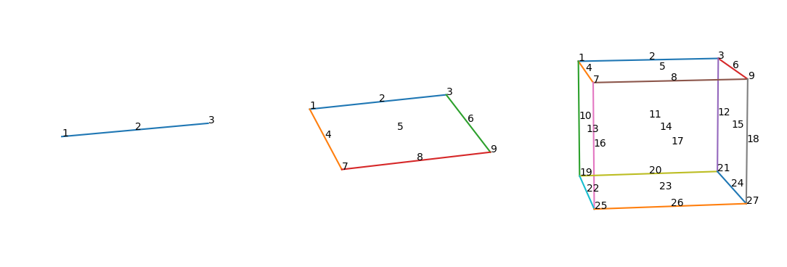
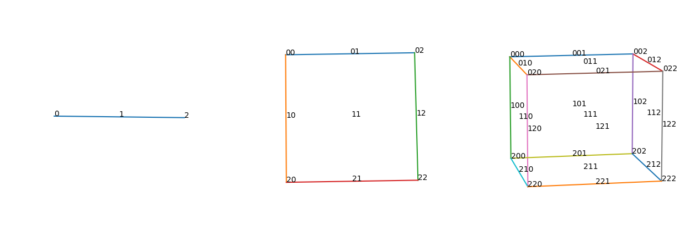

这算是个人小发现，只不过这内容这么简单，肯定已经在数学的某一领域被摸透了，
只不过因为压根没有学习，也不清楚具体在哪里会有类似案例，或许是数论？或许是图论？
用途嘛，感觉没啥用说实话，最开始发现时觉得挺有意思，过两天缓过劲后觉得这没啥有效的应用。

 

# 介绍
在编程中利用编号而不是字母代数(例如LT代表左上)代表点的位置，可以有效简化代码。

#### 一维(线段)：
给定一条线段，那么在空间中的一个点有3+1种情况：
- 0：在线段外；
- 2：在线段内；
- 1、3：在线段左、右端点上；

#### 二维(正方形)：
给定一个正方形，那么在空间中的一个点有9+1种情况：
- 0：在正方形外；
- 5：在正方形内；
- 2、4、6、8：在正方形的边上，分别是上、左、右、下；
- 1、3、7、9：在正方形角点上，分别是左上、右上、左下、右下；

#### 三维(正方体)：
给定一个正方形，那么在空间中的一个点有27+1种情况：
- 0：在正方体外；
- 14：在正方体内；
- <6个>：在正方形的面上；
- <12个>：在正方体的棱上；
- <8个>：在正方体角点上；

 
 

## 规律

- 在线段中，从中心2出发，至多允许走一步[**±1**]，走一步可到达端点1、3；
- 在正方形中，从中心5出发，至多允许走两步[**±1**、**±3**]，走一步可到达边2、4、6、8，再走一步可到达角点1、3、7、9；
- 在正方体中，从中心14出发，至多允许走三步[**±1**、**±3**、**±9**]，走一步可到达6个面，再走一步可到达12条棱，再走一步可到达6个角点；

其中，**±1**、**±3**、**±9**等价于向三个维度进行移动。

 

如果将上面十进制的点先-1然后再改成三进制，将得到下面的图(此时外界点无定义)：

以正方体为例，依旧是从中心点出发，
对``111``的第一个数字 **±1** 可得``110``和``112``，这两个值分别对应于正方体的左面和右面，即对第一个数字 **±1** 等价于向左/右移动。
同理的，对第二三数字 **±1** 等价于向前/后和向上/下移动。

