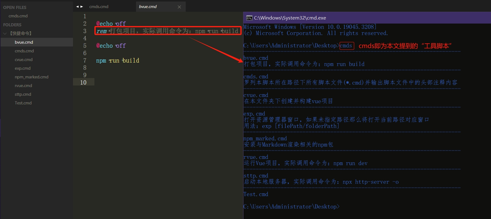

# 自定义CMD命令：

- ``cmds``：输出目录下的自定义命令的名称以及命令文件中的头部注释内容
- ``exp``：资源管理器explorer的简写，同时也能额外传入一个参数作为目标路径
- ``cvue``：在本路径下创建并构建vue项目
- ``rvue``：实际调用命令为：npm run dev，一般用于运行Vue项目所以就把这命令写成``rvue``

# ``cmds.cmd``运行截图：

# 说明：
- 资源在附录中，需自行下载
- 建议在环境变量中配一个路径方便调用和维护命令

## 小喷

只要稍微接触过bat，都知道，这玩意儿，到底有多粪。 
命令停留在十几年前(甚至是几十年前？)的状态，难用的要死，并且语法还怪的不行，例如``百分号%``、``转义字符^``、``for循环命令``、``if判断语句``，用法各写各的，没一个善茬，一个简单的脚本甚至可能要花上几十分钟甚至数小时去研究和编写(因为会碰到各种奇怪用法+隐匿问题)。 
好像V软也不怎么想维护命令行工具(毕竟历史包袱辣么重)，更多是投入到新工具``PowerShell``的开发中。

